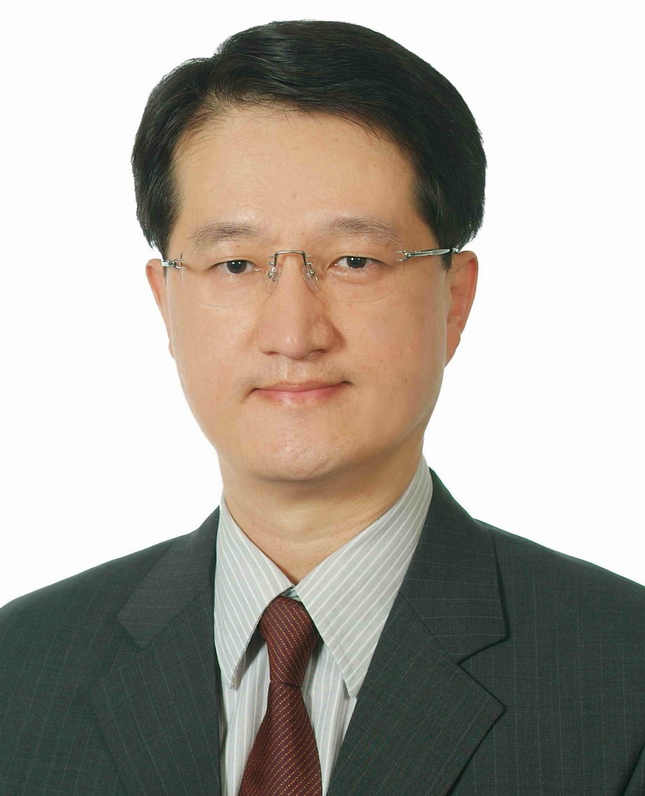
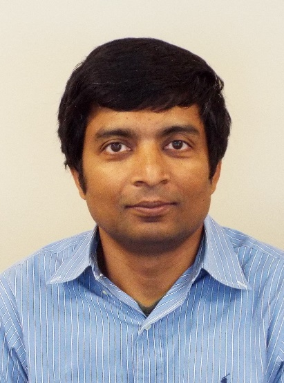

**6th International Workshop on Big Data, Streams and Heterogeneous Source Mining: Algorithms, Systems, Programming Models and Applications**

[KDD 2017](http://jmlr.org/proceedings/), August 13, Halifax, Nova Scotia, Canada

Previous KDD BigMines in 

* Beijing 2012 (<a href="http://bigdata-mining.org/bigmine-12/" target="_blank">BigMine 12</a>)
* Chicago 2013 (<a href="http://bigdata-mining.org/bigmine-13/" target="_blank">BigMine 13</a>)
* New York City 2014 (<a href="http://bigdata-mining.org/bigmine-14/" target="_blank">BigMine 14</a>)
* Sydney 2015 (<a href="http://bigdata-mining.org/bigmine-15/" target="_blank">BigMine 15</a>),
* and in San Francisco 2016 (<a href="https://bigmine.github.io/bigmine16" target="_blank">BigMine 16</a>),

Previous Keynote Speakers:
-----------------------

 
 
 

 
 
 

 > This workshop aims to bring together people from both academia and industry to present their most recent work related to these issues, and exchange ideas and thoughts in order to advance this big data challenge. 

Our ability to collect data in various sensors, devices, formats, either from independent or connected applications, has significantly outpaced our capability to process, analyze, store and understand these datasets. Social networking has flourished, and applications like Facebook and Twitter, that allow users to freely create contents, further amplify the already huge volume of web data. Furthermore, smartphones are now becoming ubiquitous, and these devices are becoming the sensory gateway to get real-time data on people from different aspects, the vast amount of data that mobile carriers can potentially process to improve our daily life has significantly outpaced our past CDR (call data record)-based processing for billing purposes only. People and devices (from home coffee machines to cars, to buses, railway stations and airports) are becoming increasingly connected. Trillions of such connected components will generate a huge data ocean, and valuable information must be discovered from the data to help improve quality of life and make our world a better place. 

 > The IoT and Big Data challenge that has been considered as one of the most exciting opportunities in the past 10 years.

* Paper Submission deadline: May 26th, 2017, 23:59PM Pacific Standard Time
* Acceptance notification: June 16, 2017
* Workshop Final Paper Due: June 30, 2017
* Workshop: August 13, 2017

Sponsors & Supporters:
-----------------

