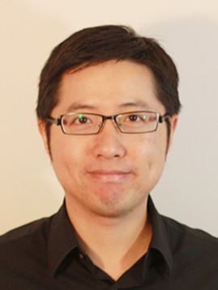

## Jure Leskovec (Stanford University) - Mining Online Networks and Communities

The Internet and the Web fundamentally changed how we live our daily lives as well as broadened the scope of computer science. Today the Web is a `sensor' that captures the pulse of humanity and allows us to observe phenomena that were once essentially invisible to us. These phenomena include the social interactions and collective behavior of hundreds of millions of people, recorded at unprecedented levels of scale and resolution. Analyzing this data offers novel algorithmic as well as computational challenges. Moreover, it offers new insights into the design of information systems in the presence of complex social feedback effects, as well as a new perspective on fundamental questions in the social sciences.

 
| *Bio*: Jure Leskovec is assistant professor of Computer Science at Stanford University. His research focuses on mining large social and information networks. Problems he investigates are motivated by large scale data, the Web and on-line media. This research has won several awards including a Microsoft Research Faculty Fellowship, the Alfred P. Sloan Fellowship and numerous best paper awards. Leskovec received his bachelor's degree in computer science from University of Ljubljana, Slovenia, and his PhD in in machine learning from the Carnegie Mellon University and postdoctoral training at Cornell University. You can follow him on Twitter @jure |  | 

## Martin Wicke (Google) - Learning from Real-World Data with TensorFlow

Based on Google's experience with data processing and
machine learning at very large scale, we have developed TensorFlow, a
tool for machine learning that is both flexible enough to adapt to new
results in a quickly advancing field of machine learning; general
enough to be applied to any algorithm or input data one can throw at
it; and powerful enough to solve problems at scale. In this talk, I
will introduce TensorFlow, and show how we can use it to solve
problems involving large data, fast data, or uncommon deployment
environments.

 
| *Bio*: Martin Wicke works on TensorFlow. Before joining Google, he worked in various startups on Machine Learning, VR, and advanced manufacturing. He did research on physics simulations, sensor networks, and computational geometry at Berkeley and Stanford, and holds a PhD from ETH Zurich. | |

## Huan Liu (Arizona State University) - Big Data + Deep Learning = A Universal Solution?

"Big data is the new oil." With big data and prevalent successes of deep learning, we seem approaching a nirvana of ultimate AI faster than ever. In this talk, we examine if a universal solution that appears omnipotent is within our reach, or if we could extend its reach. We present some questions related to big data, e.g., how to algorithmically evaluate the understandability of machine-learned topics from large text data, how to make `big’ data bigger, and how we can use data to verify hypotheses that are interesting and challenging. We hope to reach an optimistic conclusion that more research issues are awaiting data miners and we shall be better equipped to advance our field with more data and newer tools. 

 
| *Bio*: Dr. Huan Liu is a professor of Computer Science and Engineering at Arizona State University. He was recognized for excellence in teaching and research in Computer Science and Engineering at Arizona State University. His research interests are in data mining, machine learning, social computing, and artificial intelligence, investigating problems that arise in real-world applications with high-dimensional data of disparate forms. His well-cited publications include books, book chapters, encyclopedia entries as well as conference and journal papers. He serves on journal editorial/advisory boards and numerous conference program committees. He is a Fellow of IEEE and a member of several professional societies. http://www.public.asu.edu/~huanliu |  | 

## Kai Chen (Hong Kong Univ. of Science & Technology) - Towards Datacenter-Scale Deep Learning with Efficient Networking 

With the rapid growth of model complexity and data volume,
deep learning systems require more and more servers to perform
parallel training. Current deep learning systems with multiple
servers/GPUs are usually implemented in a single cluster, which
typically employs Infiniband fabric to support Remote Direct Memory
Access (RDMA), so as to achieve high throughput and low latency for
inter-server transmission. It is expected that, with ever-larger
models and data, deep learning systems must scale to multiple
clusters, which necessitates highly efficient inter-cluster networking
stack with RDMA support. Since Infiniband is only suited for
small-scale clusters of less than thousands of servers, we believe
RDMA-over-Converged-Ethernet (RoCE) is a more appropriate networking
technology choice for multi-cluster datacenter-scale deep learning.
Therefore, we endeavor to incorporate RoCE for deep learning systems,
such as Tensorflow and Tencent's Amber. In this talk, I will overview
the technical challenges and present our progress towards
datacenter-scale deep learning.

 
| *Bio*: Kai Chen is an Associate Professor with Department of Computer Science and Engineering, Hong Kong University of Science and Technology. He received his PhD in Computer Science from Northwestern University, Evanston IL in 2012. His research interests include networked systems design and implementation, data center networks, and networking support for cloud, big-data and deep-learning/AI systems.  He values practical system research, has published in various top venues such as SIGCOMM and NSDI, and is now actively working with IT companies such as Tencent, Huawei, Microsoft, Nvidia, etc., to translate his research into practice. | |

